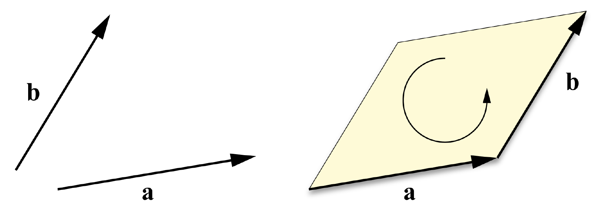
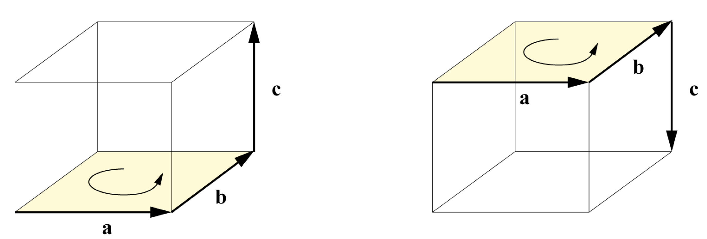

## Clifford Algebras

The Clifford Algebras describe a set of algebras extending the real numbers.
In this context, we're discussing "an algebra" which refers to something like a number system - a mathematic structure that includes some sort of number and a multiplication operation between them.
This is different from the general term "algebra" which describes math involving variables.

In *n* dimensions, take the real numbers and add *n* special units $$ e_1, e_2, \ldots, e_n $$
Then, choose whether each $$ e_i $$ squares to 0, 1, or -1.

**Complex Numbers** are an example of a Clifford Algebra - specifically, the one dimensional numbers with a single unit $$ e $$, usually called $$ i $$, that squares to $$ -1 $$.
Another example that comes up the **Dual Numbers**, one dimensional numbers where $$ e $$ squares to 0.

**Grassman Algebra** or **Exterior Algebra** is an n dimensional algebra where all $$ n $$ of the $$ e_i $$ square to 0.

## The Wedge Product

Also known as the progressive product or the exterior product,
the wedge product is the basis for a lot of the math we do in 3D computer graphcs.

$$ a \wedge b $$

The wedge product operates on scalars, vectors, and more.
Operations involving scalars should be very familiar:

$$ s \wedge t = t \wedge s = st $$

$$ s \wedge \vec v = \vec v \wedge s = s \vec v $$

The first interesting part of the wedge product is that a vector wedged with itself is 0.

$$ \vec v \wedge \vec v = 0 $$

This leads to what's called anti-commutivity for this operation on vectors.

$$ (\vec a + \vec b) \wedge (\vec a + \vec b) = 0 $$

$$ \vec a \wedge \vec a + \vec a \wedge \vec b + \vec b \wedge \vec a + \vec b \wedge \vec b = 0 $$

$$ \vec a \wedge \vec b + \vec b \wedge \vec a = 0 $$

$$ \vec a \wedge \vec b = - \vec b \wedge \vec a $$

### Bivectors

Another property of the wedge product is that the product of two vectors is not a vector -
it is something else, specifically a **bivector**.
Bivectors are distinct from scalars and vectors, and represents an oriented 2D area
(whereas a vector represents an oriented 1D direction and scalars are zero-dimensional values).

{:class="img-thumbnail"}

The orientation of this area is sometimes called the "winding" and can be described as clockwise or counterclockwise.
This also illustrates the anticommutivity of the wedge product - changing the order of operands reverses the orientation of the bivector.

### Bivectors in 3D

Start with 3 orthonormal basis vectors $$ e_1, e_2, e_3 $$.
Then, a 3D vector $$ \vec a $$ can be expressed as

$$ a_1 e_1 + a_2 e_2 + a_3 e_3 $$

from this we can see that:

$$ a \wedge b = (a_1 e_1 + a_2 e_2 + a_3 e_3) \wedge (b_1 e_1 + b_2 e_2 + b_3 e_3) $$

Multiply through and cancel out every $$ e_i $$ product with itself:

$$ a \wedge b = a_1 b_2 (e_1 \wedge e_2) + a_1 b_3 (e_1 \wedge e_3) + a_2 b_1 (e_2 \wedge e_1) + $$

$$              a_2 b_3 (e_2 \wedge e_3) + a_3 b_1 (e_3 \wedge e_1) + a_3 b_2 (e_3 \wedge e_2) $$

Then group parts with the same wedge products:

$$ a \wedge b = (a_2 b_3 - a_3 b_2) (e_2 \wedge e_3) + $$

$$ (a_3 b_1 - a_1 b_3) (e_3 \wedge e_1) + $$

$$ (a_1 b_2 - a_2 b_1) (e_1 \wedge e_2) $$

These three bivectors, $$(e_2 \wedge e_3)$$, $$(e_1 \wedge e_3)$$, and $$(e_1 \wedge e_2)$$, form the basis for any bivector.
That is, any bivector can be written as a linear combination of these three bivectors.

This is a little unwieldy to write so we use shorthand notation for these bivectors:

$$ e_{12} = e_1 \wedge e_2 $$

$$ e_{23} = e_2 \wedge e_3 $$

$$ e_{31} = e_3 \wedge e_1 $$

$$ e_{123} = e_1 \wedge e_2 \wedge e_3 $$

Using that same notation we can write out the wedge product a little more compactly:

$$ a \wedge b = (a_2 b_3 - a_3 b_2) e_{23} + (a_3 b_1 - a_1 b_3) e_{31} + (a_1 b_2 - a_2 b_1) e_{12} $$

This looks quite a bit similar to the cross product, but it is a bit more than a cross product.
The cross product is only defined in 3D, and is not associative.

$$ (\vec a \times \vec b) \times \vec c \neq \vec a \times (\vec b \times \vec c) $$

Conversely, the wedge product is both associate and defined in all dimensions.
This comes from the fact that the wedge between two vectors is not a vector - it's a bivector.

### Trivectors

Similarly, the wedge product of three vectors produces a **trivector**.
Trivectors represent a 3D oriented volume.

$$ \vec a \wedge \vec b \wedge \vec c $$

{:class="img-thumbnail"}

If one of the vectors is reversed, the opposite (negated) volume is produced.

A 3D trivector only has one component:

$$ \vec a \wedge \vec b \wedge \vec c = $$

$$ (a_1 b_2 c_3 + a_2 b_3 c_1 + a_3 b_1 c_2 - a_1 b_3 c_2 - a_2 b_1 c_3 - a_3 b_2 c_1) e_{123} $$

And the magnitude is:

$$ \text{det}
\begin{bmatrix}
\vec a & \vec b & \vec c \\
\end{bmatrix}
$$

(This is where the determinant comes from - it is derived from exterior algebra)

All of these entities in exterior algebra have a **grade**, which is really just "how many vectors were wedged to get this?"

- Scalars have grade 0
- Vectors have grade 1
- Bivectors have grade 2
- Trivectors have grade 3
- etc.

In 3D algebra, we can't get higher than trivectors.
In any *n* dimensional exterior algebra, you can't have entities with grade greater than *n*.

In four dimensions, we have four basis vectors $$ e_1, e_2, e_3, e_4 $$, and a fifth entitiy - quadvectors (with grade 4).

## Antivectors and Antiscalars

Trivectors are somewhat interesting - they are a lot similar to scalars, in that they only have one "component".
These are sometimes called antiscalars.

Bivectors are similarily similar to vectors, they both have three components.
Therefore they are sometimes called antivectors.

The wedge product between a vector and an antivector is the dot product.

And this is what we do in shading - $$ N \cdot L $$ - $$ N $$ is an antivector.

